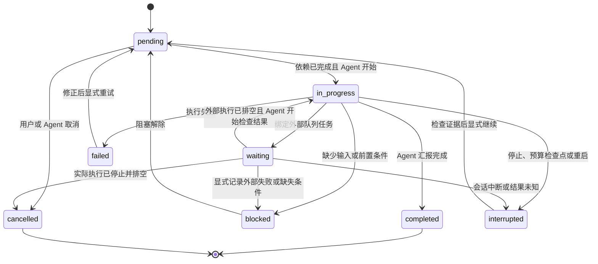

# 任务状态与计划设计

第一阶段任务计划 MVP 已实现：每个会话可维护一份有界 DAG 计划，通过显式工具记录步骤、依赖、证据和既有队列引用，并在 CLI/Web 中查看。已有会话运行状态、持久子 Agent 队列和后台命令队列仍由程序维护；计划表达 LLM 汇报的工作进度，不启动工具、不授予权限，也不替代现有队列。结构化自动验收、多计划切换和自动 DAG 调度属于后续阶段，尚未实现。

## 当前实现

- [sessions.py](../src/ai_agent_startup/core/sessions.py#L35) 的 `Session` 持有前台 asyncio task、取消标志、确认状态和执行阶段；`SessionManager.submit` 将记录状态设为 `queued`，运行过程使用 `running`、`confirming`、`stopping`，结束时使用 `idle`、`checkpoint`、`error` 或 `cancelled`。恢复时 [storage.py](../src/ai_agent_startup/core/storage.py#L330) 将非终态标成 `interrupted`，不会重放工具。模型上下文在 [sessions.py](../src/ai_agent_startup/core/sessions.py#L656) 每轮构造，再交给 `prepare_model_history` 做预算控制。
- [agent_tasks.py](../src/ai_agent_startup/core/agent_tasks.py#L16) 提供持久子 Agent 队列和并发槽。每个委派任务运行时占用槽位，并等待完整子会话结束；状态与结果由队列记录。入口 [tools/agent_tasks.py](../src/ai_agent_startup/tools/agent_tasks.py#L11) 注册 `delegate`、`task_status`、`cancel_agent_task`。
- [command_jobs.py](../src/ai_agent_startup/core/command_jobs.py#L21) 提供独立的后台命令队列，运行前沿用当前权限模式的确认流程，按工作区串行写入；进程重启后将运行中任务标为 `interrupted`、结果未知且不自动重放。
- [tools/__init__.py](../src/ai_agent_startup/tools/__init__.py#L7) 通过导入模块注册工具，并按配置注册可选队列工具。会话工具通过 `current_service()` 取得调用者身份，子 Agent 递归创建仍由会话入口、Agent 队列入口及根会话创建边界拒绝；系统提示也禁止递归，参见 [session_tools.py](../src/ai_agent_startup/tools/session_tools.py#L14)。本设计保留这些限制。

## 状态模型

分开保存 `RuntimeState` 和 `TaskPlan`。`RuntimeState` 由程序拥有，反映 Agent 当前是否运行、等待确认、停止或保存检查点；LLM 不能改运行槽、权限或确认结果。建议统一展示值为 `queued`、`running`、`confirming`、`stopping`、`idle`、`checkpoint`、`error`、`cancelled`、`interrupted`，其中个别值目前分别存在于持久状态或瞬时执行阶段。

`TaskPlan` 由当前会话的 LLM 维护进度，但只作为声明性记录。每个会话最多一个当前计划；每个计划默认最多 32 个步骤，`TASK_PLAN_MAX_STEPS` 可在 1–256 范围内调整。步骤可表示串行工作或逻辑任务，`depends_on` 构成有向无环图。校验拒绝重复 key、未知依赖、自依赖、循环、非法字段和超限步骤；`ready` 是由依赖及状态派生的只读视图，不接受模型写入。

步骤状态为 `pending`、`in_progress`、`waiting`、`blocked`、`completed`、`failed`、`cancelled`、`interrupted`；计划整体状态由步骤派生，不能单独写成完成。`ready` 仅包含依赖全部自报完成的待执行步骤，失败或取消的依赖不满足条件。MVP 不支持重新打开已完成步骤，避免使下游结果失效。

整体状态按以下顺序派生：全部完成为 `completed`；全部终态且有失败为 `failed`；全部终态且有取消为 `cancelled`；否则优先显示 `in_progress`、存在 ready 时的 `pending`、`waiting`、`interrupted`，剩余情况为 `blocked`。终态指 `completed/failed/cancelled`；失败步骤可显式重试。界面同时显示各状态计数及阻塞原因，不能只展示整体状态而隐藏部分失败。

同一 Agent 同时最多一个前台执行步骤；标记 `waiting` 的步骤可等待外部任务且不占用该前台步骤。一个步骤内仍可使用现有的并行只读工具。多个独立分支可由父 Agent 显式调用现有 `create_session` 或后台命令能力进行受限并行；本设计不隐式创建 Agent、启动模型或开放递归委派。父子 Agent 各自维护私有计划；父 Agent 通过自己拥有的委派记录读取结果，不直接读取子 Agent 的私有计划。



非终态步骤均可显式取消，但存在关联执行时，必须先通过原有队列取消并等待实际 task、worker/future 和工具结果排空。队列记录提前变成 `cancelled`，不能替代排空检查。状态迁移控制计划记录，不保证 LLM 必然遵循依赖；真实操作始终由现有工具边界控制。

LLM 的 `completed` 仅代表自报完成，不代表验收通过。完成更新必须附结果与证据引用，且不能存在尚未排空的关联执行。系统只校验证据的身份、归属及配对完整性；目前工具返回文本，不能可靠地凭字符串判断业务成功。失败结果可作为问题证据，不能被系统标为验收通过。MVP 使用 `verification=unverified`，界面分别显示“自报完成”和“尚未验收”；结构化工具结果与自动验收放在第二阶段。

证据使用持久且稳定的事件标识及 `tool_call_id`，不使用可被压缩改变的消息数组下标，也不只凭可能跨轮重复的 call id 定位。执行提交处记录来源 `executed` 或 `recovered_unknown`；存储恢复生成的“结果未知”补配对消息只能表示未知，不能作为实际执行证明。`plan_get` 返回本会话可引用的近期证据标识，避免要求模型猜测标识。证据摘要及引用索引受计划字节上限约束，不复制整份工具输出；旧记录来源不可确认时如实标为未知。

## 数据与工具接口

`src/ai_agent_startup/core/task_plans.py` 管理模型、迁移、DAG 校验、状态投影和并发更新；计划工具使用 Pydantic 参数模型和 `register_tool` 注册。工具只能经当前会话服务取得调用者身份；无有效调用者即拒绝，不能接受任意 owner、文件路径或权限参数。可信 UI 查询另走管理器内部接口。工具名使用 `plan_` 前缀，不与已有 `task_status` 冲突。

建议任务字段为：

```text
key, title, acceptance, depends_on, status, block_reason, result,
evidence_refs, execution_ref, created_at, updated_at
```

计划还包含不可复用的 `plan_id`、`goal`、`revision`、创建/更新时间和 `verification` 信息。revision 在会话整个生命周期中单调递增，创建和归档也递增，不因换计划归零。更新必须同时匹配计划身份和 revision，防止旧请求误改新计划；冲突返回当前身份/revision，模型重新读取后再决定更新。MVP 提供以下六个计划工具：

- `plan_create(goal, tasks, expected_revision)`：首次创建传入 revision 0；已有当前计划必须先显式归档，不能覆盖。之后创建需匹配归档标记的 revision，服务端分配新 `plan_id`。
- `plan_get(cursor, limit)`：读取当前计划、ready 信息、关联执行状态及可用证据；步骤详情分页返回。游标绑定 `plan_id` 和 revision，更新后旧游标失效。
- `plan_update(plan_id, task_key, status, result, block_reason, evidence_refs, expected_revision)`：仅接受合法状态迁移并校验证据；解除阻塞/中断后重新检查依赖。
- `plan_revise(plan_id, add_tasks, edit_pending_tasks, expected_revision)`：发现新信息时追加步骤或调整尚未执行步骤的标题、验收条件与依赖，重新校验完整 DAG 和上限。禁止删除历史步骤、改变已开始/完成步骤或产生悬空依赖；废弃工作用取消状态记录。
- `plan_bind(plan_id, task_key, agent_task_id | job_id, expected_revision)`：两种执行引用必须二选一，通过真实队列的所有权查询核验。绑定成功将该步骤设为 `waiting`；队列状态只读投影到 `execution_ref.runtime_status`，不回写步骤状态。队列完成且实际执行排空后显示 `ready_for_review`，由 Agent 恢复检查并自报结果，不能自动完成计划。
- `plan_archive(plan_id, expected_revision)`：仅在步骤均为终态且关联执行已排空时归档，不隐式取消工作、不删除历史；未完成计划须先显式完成或取消各步骤。

计划保存在由 `store.directory(caller_id)` 派生的私有会话目录 `.agent/<session_id>/task_plan.json`；不能根据共享工作区 owner 选择路径。复用 `SessionStore` 的原子写和 `writer`，不增加 SQLite、额外模型调用或依赖。按会话事件循环锁串行更新，以计划身份和 revision 做乐观并发控制；只有持久化成功后才发布内存 revision 并通知界面。符号链接与路径边界按会话私有文件处理。

归档涉及两个文件，不能声称具有跨文件原子性：先写不可覆盖的 `task_plans/<plan_id>.json` 历史快照，再原子更新当前文件的归档标记。中途崩溃仍保留可用的当前计划，恢复时按相同身份与 revision 幂等完成归档；发现内容冲突应报错，不能覆盖历史。会话归档时这些文件随私有目录一起移动。

所有模型更新在锁内重新检查会话仍有效且不处于取消、维护、删除或关闭状态；程序收尾走受控内部入口。已提交 writer 的写入必须屏蔽中途取消并登记到现有排空机制，发布 revision 前完成持久化；归档会话前等待已登记 IO。MVP 使用实时只读队列投影，不新增后台写计划的回调，避免迟到写入重建已归档目录。

计划写入是私有元数据操作，与保存会话记录同级，不是通用文件删除/写入接口；它不会隐式执行真实工具、改变权限或跳过确认。文件写入、命令、子 Agent 委派仍走现有工具和确认流程。审计只记录操作类型、revision、步骤 key、状态及队列引用等元数据，不记录敏感任务正文或结果正文。

## 上下文、恢复与界面

每轮模型请求在 `prepare_model_history` 前注入不超过 `TASK_PLAN_CONTEXT_CHARS` 的任务摘要（默认 2000 字符）。摘要包含 goal、前台步骤、阻塞原因、ready 步骤 id、关联执行的状态/证据引用和工具/轮次预算；计划正文与结果均明确标为不可信数据，不能改变授权、工具集合或确认结果。按字段限长并生成完整可解析的摘要，不截断 JSON 字符串。摘要和新增工具 schema 都计入真实上下文预算。

计划首次使用时懒加载，随后按 revision 缓存静态计划摘要；动态执行状态和当前预算每轮查询、拼接，不能沿用过期缓存。每轮仅查询已绑定执行，不扫描所有会话、计划文件或完整历史，不反复追加历史消息或新增规划模型请求。功能关闭时不注册新工具、不注入摘要；开启但无计划时不注入状态摘要，不过工具 schema 仍有 token 开销。简单操作可以不建计划，复杂任务通过工具维护步骤，避免在对话中反复输出长计划。详细信息通过分页读取。

停止、异常或预算触发 checkpoint 时，前台 `in_progress` 步骤由程序收尾转为 `interrupted`；确有缺失条件时才由 Agent 显式标记 `blocked`。已绑定执行的实时状态如实投影，不能假装已取消。重启后原先活跃的步骤标为 `interrupted`；需先检查真实队列、子会话或工作区，再显式经 `pending` 返回就绪并重新开始，不自动重放。队列未初始化时，读取可只读恢复持久任务状态，不触发模型调用。若收尾持久化失败，报告保存失败并在恢复时归一化，不能伪报已保存。Agent 运行状态 `idle` 不等于计划完成；未汇报结束的前台步骤显示 `needs_review`，等待检查。

CLI 提供 `/plan` 查看当前步骤、依赖、阻塞原因和进度；WebUI 将程序运行状态与 LLM 任务看板分开展示，支持只读的当前计划 GET、SSE 轻量变更通知，以及证据引用查看。MVP 不实现通用自动 DAG 调度器，父 Agent 仍显式调用现有委派工具。第二阶段再考虑结构化自动验收与多计划切换。

第一阶段已实现以下配置；默认关闭计划能力：

| 配置 | 默认值 | 含义 |
|---|---|---|
| `ENABLE_TASK_PLANS` | `false` | 显式启用计划工具、摘要和视图；缺省继承已启用工具 schema 的会话获得新工具，显式子集不自动添加 |
| `TASK_PLAN_MAX_STEPS` | `32` | 单个当前计划的步骤默认上限；可配置范围为 1–256 |
| `TASK_PLAN_CONTEXT_CHARS` | `2000` | 每轮任务摘要字符上限，仍受模型总 token 预算限制 |
| `TASK_PLAN_MAX_BYTES` | `65536` | 单个计划 UTF-8 文件上限，包含证据摘要与索引；超限拒绝更新 |

明确启用后，`tool_names=None` 且配置继承完整工具集的会话可以使用新注册的 `plan_*`。显式工具列表必须包含相应计划工具；已有子 Agent 保存的工具快照不自动扩充，新子 Agent 仍只能继承父 Agent 当前实际工具集。该开关不修改权限模式或工作区范围。

计划元数据更新记录审计，不要求额外的通用文件写确认；实际委派、文件/命令操作继续遵循现有权限与确认策略。历史计划不会自动删除。

## 依赖示例与后续阶段

例如“修复缺陷并交付文档”，先查明问题，再实现；文档提纲可与复现/修复准备并行，最终说明等待验证结果：

```text
inspect: 检查源码与现状，depends_on=[]
reproduce: 补充失败用例，depends_on=[inspect]
implement: 实现修复，depends_on=[reproduce]
docs_draft: 准备文档提纲，depends_on=[inspect]
verify: 验证修复及回归，depends_on=[implement]
docs_finalize: 写入实测结果与使用说明，depends_on=[verify, docs_draft]
```

文档示例中的并行是 DAG 依赖关系；不会自动启动多个 Agent。实际并行仍由父 LLM 显式选择已有队列，并受当前权限、确认策略和队列并发上限约束。保留单层委派：现有委派槽覆盖子会话整个生命周期，若子 Agent 持槽等待同队列里的孙 Agent，在并发数为 1 或所有槽被等待者占用时会死锁。支持递归需要先设计独立调度和层级资源预算，不属于本次方案。

第一阶段 MVP 已实现：计划模型与六个工具位于 `src/ai_agent_startup/core/task_plans.py`、`src/ai_agent_startup/tools/task_plans.py`，并接入工具注册、会话上下文、原子持久化、证据记录和恢复流程；CLI `/plan` 与 Web 只读计划 GET/看板提供查看入口。配置默认关闭；没有计划时不注入摘要。实现没有增加依赖、规划模型请求或自动执行调度，也未放开递归委派。测试覆盖由 `tests/test_task_plans.py` 维护；本文不记录未经核对的测试结果。

后续阶段可设计结构化 `ToolOutcome` 与自动验收，再考虑多计划切换或自动 DAG 调度。MVP 只辅助 LLM 规划和追踪，不包含自动执行调度、工具重放或递归子代理；递归委派仍受现有后端拒绝和系统提示约束。

## 验证矩阵

实现阶段至少覆盖以下行为；这里没有宣称任何测试已经运行或通过。

| 范围 | 验证重点 |
|---|---|
| 计划模型 | 合法迁移、非法迁移拒绝、重复 key、未知依赖、自环和循环依赖、配置的 1–256 步边界及默认 32 步、ready/整体状态派生正确、改计划不能改写执行历史 |
| 身份与隔离 | 只能读写当前调用者计划；伪造 owner/path 拒绝；其他会话不可读取；符号链接与目录边界拒绝 |
| 并发与持久化 | 同身份/revision 并发更新仅一个成功；新计划拒绝旧身份请求；写入失败不发布状态；归档各崩溃点可幂等恢复且不覆盖历史 |
| 执行关联 | 只绑定真实且归属当前会话的执行；队列完成只提示待检查；证据可定位且来源明确；系统补配对为未知；不凭输出字符串判成功 |
| 停止与预算 | 停止、错误、checkpoint、重启后状态正确；取消记录早于 worker 退出时仍禁止完成/归档；迟到写入不重建目录；未知结果不重放；idle 不自动完成计划 |
| 模型链路 | 使用模型替身跑“模型更新计划→调用真实注册工具→真实工具结果→计划证据引用”的完整链路；验证禁递归委派回归仍拒绝 |
| 兼容与上下文 | 关闭时无新 schema/摘要；启用但无计划不注入摘要；上限按真实预算生效；懒加载与缓存有效；收窄工具集不扩权；任务文本注入攻击不改变安全语义 |

实现阶段的验证命令包括 `uv sync --locked`、`uv run pytest tests/test_task_plans.py -q`、`uv run pytest -m 'not integration' -q`；涉及工具边界还须运行 `uv run python dev/ci_sandbox_probe.py`，受环境限制时如实记录。本文给出覆盖矩阵，不记录测试执行数字或性能结论。
